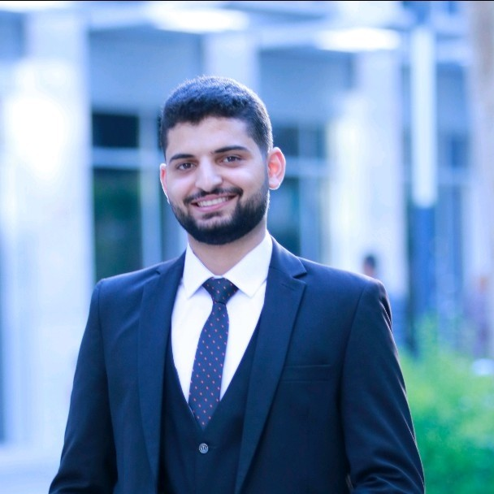

<p align="center">
  
</p>

<h1 align="center">Yousef Habbeh — Portfolio</h1>

<p align="center">
  <a href="https://flutter.dev" target="_blank"></a>
  <a href="https://dart.dev" target="_blank"></a>
  <a href="LICENSE"></a>
  <br/>
  <a href="https://github.com/yhabbeh"></a>
  <a href="https://www.linkedin.com/in/yhabbeh/"></a>
</p>

<p align="center">
  <b>Mobile Software Engineer</b> · <b>Flutter Developer</b> · <b>AI Engineer</b>
  <br/>
  A responsive Flutter web portfolio built with clean architecture, modern UI/UX, and attention to performance.
</p>

---

## ✨ Features

- **Interactive UI** — Particle background, cursor glow effect, tilt cards, scroll progress bar
- **Fully Responsive** — Adapts seamlessly from mobile to desktop via `ResponsiveContainer`
- **8 Sections** — Hero, About, Experience, Skills, Projects, Certifications, Awards, Contact
- **Dynamic Navbar** — Smooth scroll navigation with active section tracking
- **Offline-ready** — Static portfolio with no backend dependencies

## 🖥️ Live Demo

> <!-- TODO: Replace with your deployed URL -->
> [View Live](https://yhabbeh.github.io/portfolio)

## 🛠️ Tech Stack

| Layer | Technology |
|---|---|
| **Framework** | Flutter (Web) |
| **Language** | Dart (^3.11.0) |
| **Architecture** | Clean Architecture, Component-based UI |
| **State** | Stateless + Stateful widgets |
| **Packages** | `url_launcher`, `cupertino_icons` |

## 🚀 Getting Started

```bash
# Prerequisites: Flutter SDK ^3.11.0
git clone https://github.com/yhabbeh/portfolio.git
cd portfolio
flutter pub get
```

### Run in development
```bash
flutter run -d chrome
```

### Build for production
```bash
flutter build web
```

Deploy the `build/web/` directory to any static host (GitHub Pages, Vercel, Netlify, etc.).

## 📁 Project Structure

```
lib/
├── main.dart                  # App entry point
├── app.dart                   # MaterialApp, theming, color scheme
├── core/
│   ├── constants.dart         # All content data (experiences, skills, projects)
│   ├── app_colors.dart        # Color palette constants
│   └── app_text_styles.dart   # Typography definitions
├── models/
│   ├── experience_model.dart  # Experience data model
│   ├── project_model.dart     # Project data model with categories
│   └── skill_model.dart       # Skill category model
├── sections/                  # One file per portfolio section
│   ├── home_page.dart         # Main scaffold assembling all sections
│   ├── hero_section.dart      # Intro with role, tagline, CTA
│   ├── about_section.dart     # Bio and key highlights
│   ├── experience_section.dart
│   ├── skills_section.dart
│   ├── projects_section.dart
│   ├── certifications_section.dart
│   ├── awards_section.dart
│   └── contact_section.dart
└── widgets/                   # Reusable UI components
    ├── navbar.dart            # Sticky nav with active-section highlighting
    ├── section_title.dart     # Consistent heading for each section
    ├── experience_card.dart
    ├── project_card.dart
    ├── skill_chip.dart
    ├── primary_button.dart
    ├── scroll_progress_bar.dart # Top progress indicator on scroll
    ├── particle_background.dart # Animated particle canvas
    ├── tilt_card.dart          # 3D tilt-on-hover card effect
    ├── cursor_glow.dart        # Custom animated cursor glow
    └── responsive_container.dart # Adaptive width for mobile/tablet/desktop
```

## 🧑‍💻 Customization

All portfolio content lives in a single file — **`lib/core/constants.dart`**:
- Personal info, bio, and contact links
- Work experience entries (title, company, period, responsibilities)
- Skill categories and tags
- Projects with descriptions, technologies, and GitHub URLs
- Certifications and awards

Edit that file, and the portfolio updates everywhere.

## 📄 License

Distributed under the MIT License. See `LICENSE` for more information.

---

<p align="center">
  Built with ❤️ by <a href="https://github.com/yhabbeh">Yousef Habbeh</a>
</p>
